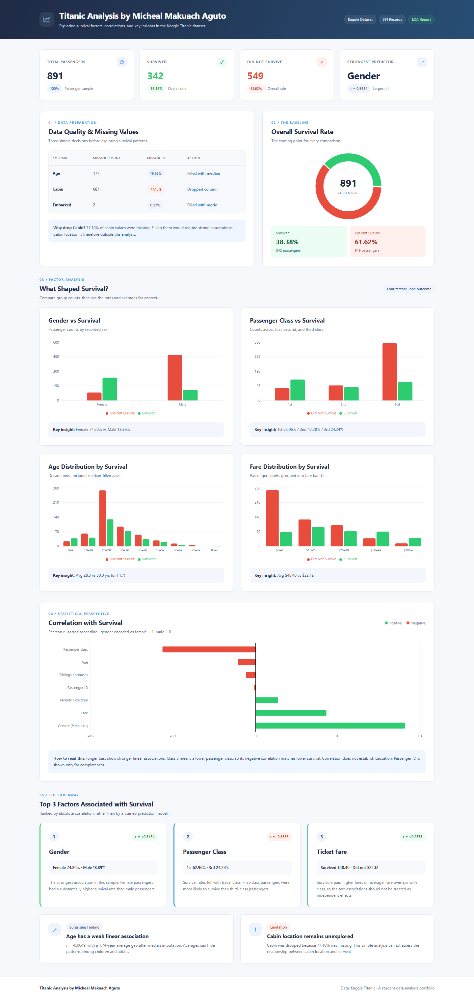

# Titanic Analysis by Micheal Makuach Aguto

A small data storytelling project exploring survival in the Kaggle Titanic passenger sample. I cleaned the data, explored it in five notebooks, built one FastAPI data endpoint, and visualized the findings with React and Recharts. The dashboard runs in one Docker container and can be deployed to Render.

Author: **Micheal Makuach Aguto** · [mikelamakuach24-droid](https://github.com/mikelamakuach24-droid) · mikelamakuach24@gmail.com



## Key Findings

| Rank | Factor | Correlation with survival | Finding |
| --- | --- | --- | --- |
| 1 | Gender (female = 1) | +0.5434 | Female survival: 74.20%; male: 18.89%. |
| 2 | Passenger class | −0.3385 | Survival: 1st 62.96%, 2nd 47.28%, 3rd 24.24%. |
| 3 | Fare | +0.2573 | Average fare: survivors 48.40; non-survivors 22.12. |

Ranked by absolute Pearson correlation, not model feature importance. These associations do not establish causation; fare and class overlap.

Age has a weak linear association (−0.0649) after median imputation: average ages are 28.29 and 30.03, a 1.74-year gap. Cabin was dropped because 77.10% was missing. Results describe this 891-record sample, not everyone aboard.

## Project layout

```text
titanic-project/
├── README.md
├── .gitignore
├── .gitattributes
├── .dockerignore
├── Dockerfile
├── compose.yaml
├── data/
│   └── Titanic-Dataset.csv          # included public dataset
├── notebooks/
│   ├── 01_data_understanding.ipynb
│   ├── 02_data_cleaning.ipynb
│   ├── 03_survival_overview.ipynb
│   ├── 04_factor_analysis.ipynb
│   └── 05_correlation_and_conclusions.ipynb
├── backend/
│   ├── requirements.txt
│   ├── analysis.py
│   ├── main.py
│   └── data/Titanic-Dataset.csv      # identical development copy
├── frontend/
│   ├── package.json
│   ├── package-lock.json
│   ├── vite.config.js
│   ├── index.html
│   └── src/
│       ├── main.jsx
│       ├── App.jsx
│       ├── api.js
│       ├── styles.css
│       └── components/
│           ├── Header.jsx
│           ├── KpiCards.jsx
│           ├── MissingValues.jsx
│           ├── SurvivalPie.jsx
│           ├── FactorCharts.jsx
│           ├── CorrelationChart.jsx
│           └── Conclusion.jsx
└── docs/
    ├── screenshot.png
    └── deployment.md
```

Notebook 02 creates `data/cleaned.csv` locally; generated data stays outside commits and the Docker image. The supplied raw CSV is included in the project and production image. Temporary verification tools, virtual environments, Node modules, and build output are ignored.

Repository: [mikelamakuach24-droid/titanic-project](https://github.com/mikelamakuach24-droid/titanic-project). Feature branches merge into `development`, then `staging`, then `main`.

## Getting the data

The public Titanic dataset is already included, so the dashboard needs no data download or credentials. Source: [Kaggle Titanic competition](https://www.kaggle.com/competitions/titanic/data). To replace it, download **train.csv**, rename it **Titanic-Dataset.csv**, and replace both `data/` and `backend/data/` copies. The test file has no `Survived` target.

## Running it

With Docker Desktop running, execute this from the project root:

```sh
docker compose up --build
```

Open **http://localhost:8080**. One container serves the dashboard and API. Stop it with `docker compose down`. See [the deployment guide](docs/deployment.md) for the exact Docker Hub commands and Render settings; no Git is required.

For development without Docker:

Use Python 3.12+ and Node.js 22+. Open two terminals at the repository root.

Backend — terminal 1 (Windows PowerShell):

```powershell
python -m venv .venv
.\.venv\Scripts\Activate.ps1
python -m pip install -r backend/requirements.txt
cd backend
uvicorn main:app --reload --port 8000
```

On macOS/Linux, activate with `source .venv/bin/activate` instead. If PowerShell blocks activation, use `.venv\Scripts\python.exe` for installation and `..\.venv\Scripts\python.exe -m uvicorn main:app --reload --port 8000` from `backend/`.

Frontend — terminal 2:

```sh
cd frontend
npm install
npm run dev
```

Open **http://localhost:5173**. Vite proxies `/api` to the backend on port 8000. Keep both terminals running. `npm run build` creates the production frontend, which FastAPI then serves directly at **http://localhost:8000**.

For notebooks, open another terminal at the repository root, activate `.venv`, install the notebook-only dependencies with `python -m pip install matplotlib notebook`, then run `python -m notebook notebooks`. Run **01 → 05** in order; 02 saves the CSV used by 03–05. Charts and outputs are included for GitHub viewing.

## API

| Method | Endpoint | Response |
| --- | --- | --- |
| GET | `/` | Built dashboard; a welcome message before the frontend is built. |
| GET | `/api/health` | `{"status": "ok"}`. |
| GET | `/api/dashboard` | Summary, missing values, survival counts, four factor summaries, and correlations. |

The backend loads its CSV once at startup relative to `analysis.py`, fills Age with its median and Embarked with its mode, and drops Cabin. Notebook 02 applies the same cleaning steps. All dashboard numbers come from the endpoint. `/assets` serves only the compiled frontend files.

## Notebooks

| Notebook | Purpose |
| --- | --- |
| [01_data_understanding](notebooks/01_data_understanding.ipynb) | Inspect raw rows, dimensions, types, and variable roles. |
| [02_data_cleaning](notebooks/02_data_cleaning.ipynb) | Explain missing-value decisions and save cleaned.csv. |
| [03_survival_overview](notebooks/03_survival_overview.ipynb) | Establish counts, rates, and the survival pie chart. |
| [04_factor_analysis](notebooks/04_factor_analysis.ipynb) | Compare gender, class, age, and fare with four charts. |
| [05_correlation_and_conclusions](notebooks/05_correlation_and_conclusions.ipynb) | Plot sorted correlations and explain the three strongest factors. |
